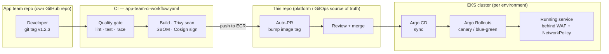
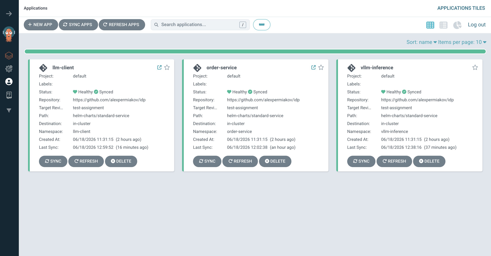

# Internal Developer Platform — the "Paved Road"

> A reference implementation of an internal platform that lets application teams ship services to production **safely, repeatably, and without talking to the platform team**.


A developer pushes a tag in their app repo. CI lints, tests, builds, scans, signs, and opens a GitOps PR against this platform repo. Argo CD picks up the merge and rolls the new version out **progressively** — canary or blue-green — behind WAF, network policies, and admission control. The developer never writes Kubernetes YAML, touches Terraform, or files a ticket.

> [!NOTE]
> **What this is.** A working platform deployed to a **real multi-account AWS Organization**, with the full control plane (IaC, CI/CD, GitOps, guardrails, progressive delivery) exercised end-to-end. The AWS environment is real but kept private — I'll walk through it live during the interview. See [Scope & Trade-offs](#-scope--trade-offs) for exactly what's real, what's constrained for this submission, and what I'd do next.
>
> This is adapted from a personal project of mine and was built AI-assisted (Claude Code) throughout.

---

## 🛣️ The paved road in one picture



**Hard gates, soft signals** — broken code (failing lint/tests), a severe security vulnerability (a `CRITICAL` Trivy finding), or an untrusted build (an unsigned image) will **stop the pipeline cold — nothing ships**. Inventory lists (SBOMs) and dashboards only **produce information; they never block**. And once a release is going out, it rolls out gradually and will **pause itself** — or, where metric analysis is enabled, **roll itself back automatically** — if the live numbers look bad.

---

## 📦 The sample apps

Three services ride the paved road, chosen to exercise different parts of it:

| Service | What it is | Endpoint | Rollout strategy |
| --- | --- | --- | --- |
| **`order-service`** | The canonical "hello world" — a tiny Go HTTP service returning fake order JSON, with `/healthz`, `/readyz`, and Prometheus `/metrics`. | `/orders` | canary |
| **`llm-client`** | A Go service that proxies prompts to a self-hosted LLM over the OpenAI-compatible API. Shows the platform handling a stateful, GPU-backed dependency. | `/ask?prompt=...` | canary |
| **`vllm-inference`** | [vLLM](https://github.com/vllm-project/vllm) serving the open-source **Meta OPT-125M** (`facebook/opt-125m`) on a GPU node pool. Self-hosted so prompt data never leaves the VPC. | internal only | blue-green |

`opt-125m` is intentionally tiny — it proves the GPU scheduling, node pool, network policy, and blue-green path without a large bill. Swap in any larger open-weights model by editing one Helm value.

> [!IMPORTANT]
> **In a real org these apps would not live in this repo.** Each app team owns its own repository and drops in [`templates/app-team-ci-workflow.yaml`](templates/app-team-ci-workflow.yaml). They are vendored here only so the whole paved road is reviewable in one place. This repo is the **platform / GitOps source of truth**: Helm charts, Argo CD app definitions, and infrastructure.

---

## 🧰 What you get

| Category | What's included |
| --- | --- |
| **Multi-account AWS** | AWS Organization with separate **tooling / dev / staging / prod** accounts; ECR lives in tooling and is pulled cross-account; SCPs guardrail every account. |
| **Progressive delivery** | Argo Rollouts with **canary** (5→20→50→80% with pauses) and **blue-green** (preview service + scale-down delay); optional Prometheus analysis to auto-abort. |
| **GitOps** | Argo CD per cluster, Helm-based deploys, PR-driven environments — `main`→staging, semver tag→prod, PR branch→ephemeral dev. |
| **Golden path Helm chart** | One `standard-service` chart gives every app a Rollout, Service, HPA, PDB, NetworkPolicy + CiliumNetworkPolicy, ServiceAccount/IRSA, and ingress from a handful of values. |
| **Security & supply chain** | WAF (OWASP), Cilium WireGuard mTLS + L7 policy, Kyverno admission control, Falco runtime detection, Trivy scanning, Cosign signing, SBOM attestation. |
| **Compliance controls** | KMS everywhere, CloudTrail→S3 (WORM), GuardDuty, Security Hub, Macie PII/PHI scanning, AWS Config rules — mapped to PCI-DSS / HIPAA / SOC 2. |
| **Observability** | Prometheus, Grafana, Loki, SLO dashboards, Hubble flow telemetry, Kubecost. |
| **Cost control** | Karpenter spot instances, scale-to-near-zero when idle. |
| **DR (scaffolded)** | Active-passive multi-region with Route 53 failover — **second region is disabled for now**; see below. |

---

## ☁️ Multi-account & multi-region

```
AWS Organization
├── tooling   → ECR (images), Terraform state, shared CI roles
├── dev        → EKS + Argo CD   (PR branches → ephemeral environments)
├── staging    → EKS + Argo CD   (main branch)
└── prod       → EKS + Argo CD   (semver release tags)
```

CI authenticates to AWS via **GitHub OIDC** (no long-lived keys) and assumes a role per account. Images are built once into the tooling account's ECR and pulled cross-account with an organization check.

**Second region is intentionally disabled.** The `us-east-1` passive region config (`infra/entry/regions/us-east-1.tfvars`) and the `dns-failover` module exist, but the secondary region is **not wired into `infra/entry/main.tf` and no workflow provisions it**. Standing up DR doubles the compliance-stack cost, so it stays off until there's a real RTO/RPO requirement. The architecture (Route 53 health-check failover, ECR replication, ~2–3 min RTO) is documented in [ARCHITECTURE.md](ARCHITECTURE.md) so turning it on is a known, scoped task rather than a redesign.

---

## ⚖️ Scope & Trade-offs

What I deliberately built, what's constrained for this submission, and what I left out — and why.

**✅ Real and exercised end-to-end**
- 🚀 **Live AWS** — deployed to a **real multi-account AWS Organization** (tooling / dev / staging / prod), not LocalStack. The screenshots below are from that live cluster.
- 🏗️ **IaC** — modular Terraform for VPC, EKS, Cilium, Argo CD, Karpenter, GPU pools, the full security/compliance stack, and shared "compliant-by-construction" building blocks (KMS keys, S3 buckets, log groups).
- 🔄 **CI/CD** — quality gate → build → Trivy → SBOM → Cosign → GitOps PR, plus the app-team template that does the same from a separate repo.
- 🟢 **Progressive delivery** — both canary and blue-green via one Helm chart, with analysis templates ready to wire to Prometheus.
- 🛡️ **Guardrails** — Kyverno policies, Cilium L3/L4/L7 default-deny network policies, SCPs, WAF.
- 🔐 **Secrets** — via External Secrets Operator; the one bootstrap secret (a GitHub App credential granting Argo CD read access to this private repo) is wired in.
- 🧪 **Tests for the platform itself** — `helm unittest` suites cover the golden-path chart: canary vs. blue-green rendering, the "canary requires an ingress" guard, the enforced pod security context, and the default-deny network policy. They run on every PR ([`platform-tests.yaml`](.github/workflows/platform-tests.yaml)) and **block the dev cluster from provisioning if they fail** — [`provision-dev.yml`](.github/workflows/provision-dev.yml) `needs:` them before any Terraform runs.

**Constrained for this submission**
- The AWS environment is **real but private**: I'm not handing over live accounts or credentials for reviewers to run themselves. I'll walk through the running platform during the interview (see [Proof it runs](#-proof-it-runs)).
- **Apps are vendored here** rather than living in their own repos (see note above).
- **Rollout analysis is configured but disabled** in the sample values — there isn't enough real traffic for the metrics to be meaningful in a demo.

**Deliberately left out (would add for a real launch)**
- A scaffolding CLI / backstage-style portal (`platform new-service ...`) — the Helm chart + template are the seam it would sit on.
- Broader policy test coverage — admission-time Kyverno/Conftest tests on top of the chart unit tests that exist today.
- A second active region (DR is scaffolded but off — see [above](#-multi-account--multi-region)).

---

## 📸 Proof it runs

These are from the live, multi-account AWS cluster, capturing the full control plane (Terraform → GitHub Actions → ECR → Argo CD → progressive rollout). **I'm happy to walk through the running platform live during the interview** — the AWS environment is real but kept private.

**Argo CD — all three services healthy and synced from this repo:**



**Grafana — platform overview: pods, namespaces, and per-namespace CPU/memory across the cluster:**


**Grafana — SLO dashboard (availability, error budget, P99, incident tracking):**


> The SLO panels read healthy because demo traffic is minimal and rollout analysis is disabled (see [Scope & Trade-offs](#-scope--trade-offs)) — the dashboards are wired up, not load-tested.

**Argo Rollouts — `order-service` progressing through the canary steps (5 → 20 → 50 → 80%) before promotion:**


**Hubble — live flow map with per-flow verdicts, showing the Cilium dataplane enforcing identity-based network policy:**


---

## 🗂️ Repository layout

```
apps/                      # Sample services (would live in their own repos)
templates/                 # app-team-ci-workflow.yaml — what app teams copy in
helm-charts/standard-service/   # The golden-path chart every service uses (+ tests/ — helm unittest)
argocd/applications/       # Argo CD app definitions per environment (dev/staging/prod)
infra/
  entry/                   # Per-cluster root module (one apply per account/region)
  modules/                 # VPC, EKS, Cilium, Argo CD, security, compliance, GPU, ...
  tooling/                 # Tooling account (ECR, state)
policies/
  scp/                     # Org-wide Service Control Policies
  iam/                     # GitHub Actions OIDC trust + permission policies
.github/workflows/         # Provision/destroy per env + security/secret scans
docs/                      # Architecture, runbooks, ADRs, operations
```

---

## ⚡ Quick start

> **Prerequisite:** a proper AWS foundation must already exist — an AWS Organization with the tooling / dev / staging / prod accounts, OIDC trust for GitHub Actions, and the Terraform state backend. This repo provisions the platform *on top of* that; it doesn't bootstrap the Organization itself. See [SETUP.md](SETUP.md).

1. Fork this repo and configure GitHub secrets / OIDC roles — see [SETUP.md](SETUP.md).
2. Create a GitHub App for Argo CD repository access.
3. Push to trigger GitHub Actions → Terraform provisions the cluster.
4. Open a PR → an ephemeral dev environment spins up automatically.

---

## 📚 Documentation

- [ARCHITECTURE.md](ARCHITECTURE.md) — system design, diagrams, security & DR architecture
- [SETUP.md](SETUP.md) — full setup instructions
- [COST.md](COST.md) — monthly AWS estimates by scale (**~$1.5k/mo** platform-only → **~$15.5k/mo** at ~8 teams)
- [TESTING.md](TESTING.md) — the five-layer testing strategy: unit · static · security · smoke · progressive-delivery gate
- [docs/operations.md](docs/operations.md) — day-2 ops: dashboards, encryption checks, capacity
- [docs/runbooks/](docs/runbooks/) — disaster recovery, incident response, SLO burn, rotations
- [docs/adr/](docs/adr/) — architecture decision records

---

## 🧱 Tech stack

- **AWS** — EKS · Karpenter · WAF · GuardDuty · Security Hub · Macie · Inspector · CloudTrail · KMS · Config
- **Kubernetes** — Cilium · Argo CD · Argo Rollouts · Kyverno · Falco · Velero · External Secrets
- **Observability** — Prometheus · Grafana · Loki · Hubble · Kubecost
- **AI/ML** — vLLM · GPU node pools (g5/g6) · NVIDIA device plugin
- **Supply chain** — Trivy · Cosign · CycloneDX SBOM
- **IaC & CI** — Terraform (modular) · GitHub Actions (OIDC)
