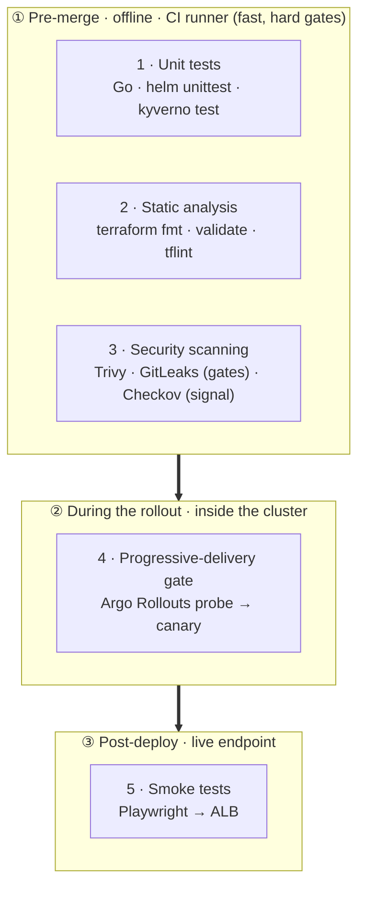
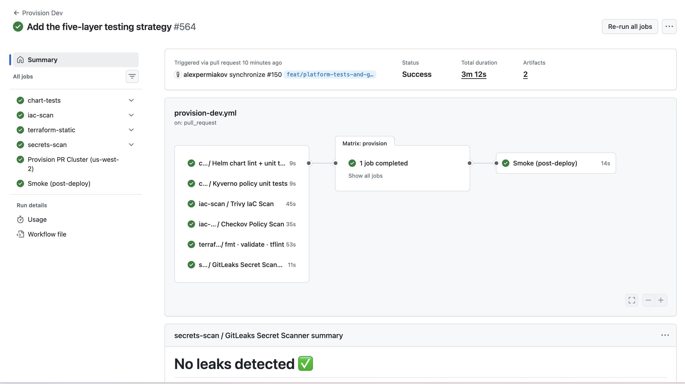

# Testing Strategy

> How the internal developer platform tests **itself** — the layers that matter **block the pipeline, or roll the release back**.

Five layers, from fast offline unit tests — covering the Helm chart and Kyverno policies every app inherits — up to an in-cluster gate that automatically rolls back a bad release.

> [!NOTE]
> **Hard gates, soft signals.** Failing unit tests, invalid Terraform, a new
> `HIGH`/`CRITICAL` IaC misconfiguration, or a committed secret **stop the
> pipeline cold — no cluster is provisioned**. Coverage numbers and Checkov's deeper scan only **produce
> information; they never block**. And once a release is rolling out, a failed
> canary probe **rolls it back automatically**.

---

## 🧪 The five layers in one picture

## 📋 Summary

| #   | Layer                 | What it tests                                                           | Tool                                       | Where it runs            | On failure                         |
| --- | --------------------- | ----------------------------------------------------------------------- | ------------------------------------------ | ------------------------ | ---------------------------------- |
| 1   | **Unit**              | app **code** + platform **logic** (rendered manifests, policy verdicts) | `go test`, `helm unittest`, `kyverno test` | CI runner, **offline**   | blocks build / blocks provisioning |
| 2   | **Static analysis**   | Terraform **source** — format, validity, lint                           | `terraform fmt`·`validate`, `tflint`       | CI runner, **offline**   | blocks provisioning                |
| 3   | **Security scanning** | image **CVEs** + IaC **misconfig** + committed **secrets**              | Trivy + GitLeaks (hard gates) + Checkov (soft signal) | CI runner, **offline**   | Trivy & GitLeaks block; Checkov informs |
| 4   | **Delivery gate**     | **canary endpoints** mid-rollout                                        | Argo Rollouts Job analysis                 | **inside the cluster**   | **auto-rollback**                  |
| 5   | **Smoke**             | live **endpoints**, end-to-end                                          | Playwright (`request` API)                 | CI runner → **live ALB** | marks the PR red (cluster kept)    |

The first three are **pre-merge gates wired into [`provision-dev`](.github/workflows/provision-dev.yml)** — a cluster is only provisioned after they pass (`needs: [chart-tests, iac-scan, terraform-static, secrets-scan]`). The delivery gate then runs **during** a canary rollout; smoke confirms the live result **after** the deploy.

### Proof it runs

The pre-merge gates blocking `provision` on a real pipeline run:

---

## 1 · Unit tests — code & platform logic

Fast, fully offline checks. Three flavours:

**App code (Go).** [`apps/order-service/main_test.go`](apps/order-service/main_test.go), [`apps/llm-client/main_test.go`](apps/llm-client/main_test.go) — `net/http/httptest` exercises the handlers offline: the JSON response shape of the API, the health and readiness probes, and the error paths. Runs as `go test -race -covermode=atomic` in the app build's quality gate ([`app-ci.yaml`](.github/workflows/app-ci.yaml)) and in the app-team template. _Tests code, in CI, offline._

**Platform chart (Helm).** [`helm-charts/standard-service/tests/`](helm-charts/standard-service/tests/) — `helm unittest` renders the golden-path chart under many value combinations and asserts the **output** is correct: canary vs. blue-green, the "canary requires an ingress" guard, the enforced pod security context, the default-deny network policy, and the canary probe step. A regression here would otherwise ship to _every_ service. _Tests rendered config, in CI, offline._

**Admission policies (Kyverno).** [`infra/modules/security/kyverno-policies/tests/`](infra/modules/security/kyverno-policies/tests/) — `kyverno test` runs each ClusterPolicy against good/bad pod fixtures and asserts the verdict (a compliant pod passes, a `:latest` / privileged / unlimited pod is **denied**). The policy YAML is the single source of truth that Terraform applies verbatim, so the test guards the real guardrail. _Tests policy logic, in CI, offline._

Chart + policy tests run in [`platform-tests.yaml`](.github/workflows/platform-tests.yaml) and **block dev provisioning**.

## 2 · Static analysis — Terraform

[`terraform-static.yaml`](.github/workflows/terraform-static.yaml) runs three cheap, no-cloud checks over `infra/` before any `apply`:

- **`terraform fmt -check`** — code is canonically formatted.
- **`terraform validate`** — each root module (`infra/entry`, `infra/tooling`) is internally consistent (backendless init, no remote state touched).
- **`tflint`** — best-practice lint via the bundled ruleset ([`infra/.tflint.hcl`](infra/.tflint.hcl)); gated on `error` severity, with style warnings surfaced as a tracked backlog.

_Tests IaC source, in CI, offline. Blocks provisioning._

## 3 · Security scanning — Trivy & GitLeaks (gates) + Checkov (signal)

Three scanners across two workflows — Trivy + Checkov in [`security-scan.yml`](.github/workflows/security-scan.yml) and GitLeaks in [`secrets-scan.yaml`](.github/workflows/secrets-scan.yaml) — plus image scanning in the app build.

**Trivy — the hard gate.** Runs in two modes: an **image** scan in the app build (a `CRITICAL` CVE stops the build) and an **IaC config** scan over `infra/`, `helm-charts/`, and `argocd/`. The config scan was hardened from report-only to a real gate: **`exit-code: 1` on `HIGH`/`CRITICAL`**, with pre-existing, triaged findings suppressed (each with a rationale) in a documented baseline — [`.trivyignore`](.trivyignore). This is the "baseline then gate" pattern: known trade-offs are accepted explicitly, anything **new** fails the build.

**Checkov — the deeper signal.** A second IaC scanner with broader checks and built-in compliance mappings (PCI/HIPAA/SOC 2) that Trivy doesn't cover. Kept **`soft_fail`** by design: it surfaces findings for review without blocking, so the two tools complement rather than duplicate each other. Documented skips carry their reasons inline.

**GitLeaks — the secrets gate.** A different category from the two IaC scanners: it scans **source content across the full git history** (`fetch-depth: 0`) for committed credentials — catching even a secret that was added and later removed but is still recoverable from history, which a working-tree scan misses. A finding **fails the run and blocks provisioning** (it's a `needs:` of `provision` in [`provision-dev.yml`](.github/workflows/provision-dev.yml)). It _complements_ Trivy/Checkov — config-correctness vs. credential-leak — rather than duplicating them.

_Tests image CVEs + IaC misconfig + committed secrets, in CI, offline. Trivy & GitLeaks block provisioning; Checkov informs._

## 4 · Progressive-delivery gate — Argo Rollouts probe

[`helm-charts/standard-service/templates/analysistemplate-canary-probe.yaml`](helm-charts/standard-service/templates/analysistemplate-canary-probe.yaml) — a **Job-based** `AnalysisTemplate` that actively `curl`s the **canary** service's `/healthz` and `/readyz`. Argo Rollouts manages the `-canary` Service to point only at the new version's pods, so the probe tests the canary specifically.

It's wired into the canary as an inline `analysis` step right after `setWeight: 5` ([`rollout.yaml`](helm-charts/standard-service/templates/rollout.yaml)): at **5% traffic**, the probe runs; a non-zero exit fails the `AnalysisRun` and **aborts the rollout — the canary is scaled back to stable (auto-rollback)** before more traffic shifts. Opt-in via `rollout.canaryProbe.enabled` (on for order-service in dev).

This is deliberately **Job-based, not metric-based**: the existing Prometheus templates (`success-rate`, `latency-check`) need real traffic to be meaningful, which a demo environment lacks — an active probe needs none. The probe Job is hardened to pass the platform's own Kyverno policies (non-root, read-only rootfs, drop `ALL`, pinned image), and the chart's default-deny NetworkPolicy already permits it via same-namespace ingress.

_Tests canary endpoints during the rollout, inside the cluster, with automatic rollback._

## 5 · Smoke tests — Playwright against the live ALB

[`tests/`](tests/) — a Playwright suite (`request` API, no browser), one spec per service under [`tests/services/`](tests/services/) with shared helpers in [`tests/lib/`](tests/lib/), that makes **real HTTP requests from the CI runner to the live internet-facing ALB** of the freshly provisioned dev cluster. It polls `/orders` until the service is actually serving (ArgoCD sync and pod start lag the ALB), then asserts the order JSON shape and repeated-request stability.

Wired as the `smoke` job in [`provision-dev.yml`](.github/workflows/provision-dev.yml) (`needs: provision`), it runs only once a real ALB URL exists. A failure **marks the PR red but leaves the cluster up** for debugging — it answers _"did what we just shipped actually come up and serve?"_, which provisioning success alone doesn't prove.

_Tests live endpoints end-to-end, in CI → live cluster, post-deploy._

---

## 🔒 What blocks what

| Stage                        | Enforced by                                                                                                          |
| ---------------------------- | -------------------------------------------------------------------------------------------------------------------- |
| App image build              | Go unit tests + Trivy image scan (quality gate)                                                                      |
| **Dev cluster provisioning** | unit tests (chart + policy) **·** Terraform static **·** Trivy IaC **·** secrets scan (GitLeaks) — all `needs:` of `provision` |
| Merge to `main`              | branch-protection **required status checks** (repo setting) — make the gate checks required so a red run can't merge |
| **Release promotion**        | the canary delivery gate (auto-rollback)                                                                             |
